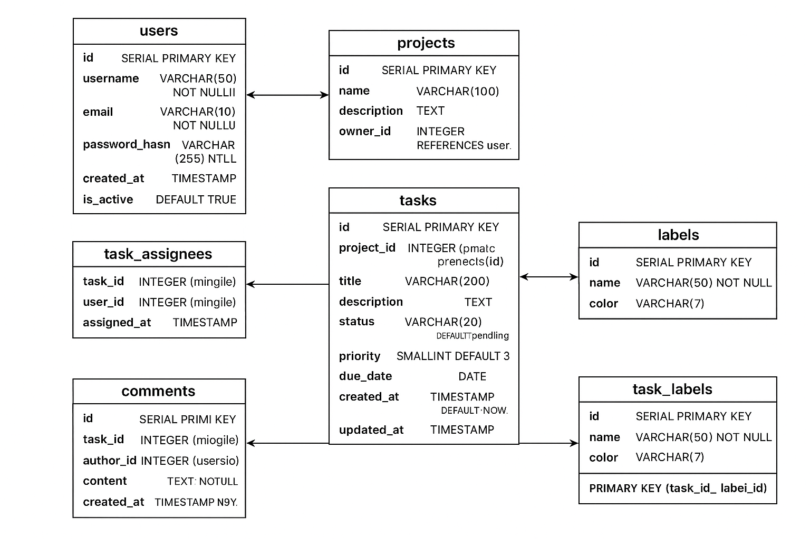
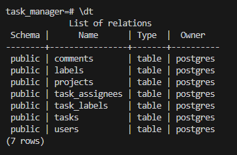
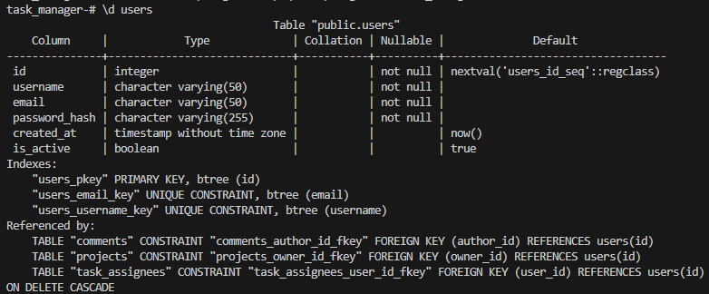

# Домашнее задание к занятию "`Базы данных`" - `Корбут Евгений`

   [Инструкция  по MarkDown](https://github.com/netology-code/sys-pattern-homework/blob/main/md-instruction.md)


   [Руководство по оформлению Markdown файлов](https://gist.github.com/Jekins/2bf2d0638163f1294637#Code)
  
### Задание 1

# Структура базы данных

Ниже представлена модель данных для системы управления задачами (Task Manager).

---

## Таблица `users`
| Поле | Тип данных | Описание |
|------|-------------|-----------|
| id | SERIAL PRIMARY KEY | Уникальный идентификатор пользователя |
| username | VARCHAR(50) NOT NULL UNIQUE | Имя пользователя |
| email | VARCHAR(50) NOT NULL UNIQUE | Электронная почта |
| password_hash | VARCHAR(255) NOT NULL | Хэш пароля |
| created_at | TIMESTAMP DEFAULT NOW() | Дата регистрации |
| is_active | BOOLEAN DEFAULT TRUE | Активен ли пользователь |

---

## Таблица `projects`
| Поле | Тип данных | Описание |
|------|-------------|-----------|
| id | SERIAL PRIMARY KEY | Уникальный идентификатор проекта |
| name | VARCHAR(50) NOT NULL | Название проекта |
| description | TEXT | Описание проекта |
| owner_id | INTEGER REFERENCES users(id) | Владелец проекта |
| created_at | TIMESTAMP DEFAULT NOW() | Дата создания |

---

## Таблица `tasks`
| Поле | Тип данных | Описание |
|------|-------------|-----------|
| id | SERIAL PRIMARY KEY | Идентификатор задачи |
| project_id | INTEGER REFERENCES projects(id) ON DELETE CASCADE | Проект, к которому относится задача |
| title | VARCHAR(200) NOT NULL | Заголовок задачи |
| description | TEXT | Подробное описание |
| status | VARCHAR(20) DEFAULT 'pending' | Статус задачи (pending, in_progress, done) |
| priority | SMALLINT DEFAULT 3 | Приоритет (1 — высокий, 5 — низкий) |
| due_date | DATE | Срок выполнения |
| created_at | TIMESTAMP DEFAULT NOW() | Дата создания |
| updated_at | TIMESTAMP | Последнее обновление |

---

## Таблица `task_assignees`
| Поле | Тип данных | Описание |
|------|-------------|-----------|
| task_id | INTEGER REFERENCES tasks(id) ON DELETE CASCADE | Идентификатор задачи |
| user_id | INTEGER REFERENCES users(id) ON DELETE CASCADE | Идентификатор пользователя |
| assigned_at | TIMESTAMP DEFAULT NOW() | Дата назначения |
| **PRIMARY KEY** | (task_id, user_id) | Составной ключ |

---

## Таблица `comments`
| Поле | Тип данных | Описание |
|------|-------------|-----------|
| id | SERIAL PRIMARY KEY | Идентификатор комментария |
| task_id | INTEGER REFERENCES tasks(id) ON DELETE CASCADE | К какой задаче относится |
| author_id | INTEGER REFERENCES users(id) | Кто оставил комментарий |
| content | TEXT NOT NULL | Текст комментария |
| created_at | TIMESTAMP DEFAULT NOW() | Дата и время добавления |

---

## Таблица `labels`
| Поле | Тип данных | Описание |
|------|-------------|-----------|
| id | SERIAL PRIMARY KEY | Идентификатор метки |
| name | VARCHAR(50) NOT NULL UNIQUE | Название метки |
| color | VARCHAR(7) | Цвет в HEX-формате (например, `#FF9900`) |

---

## Таблица `task_labels`
| Поле | Тип данных | Описание |
|------|-------------|-----------|
| task_id | INTEGER REFERENCES tasks(id) ON DELETE CASCADE | Идентификатор задачи |
| label_id | INTEGER REFERENCES labels(id) ON DELETE CASCADE | Идентификатор метки |
| **PRIMARY KEY** | (task_id, label_id) | Составной ключ |

---

## ER-схема базы данных



### Задание 2

```sql
-- Таблица пользователей
CREATE TABLE users (
    id SERIAL PRIMARY KEY,
    username VARCHAR(50) NOT NULL UNIQUE,
    email VARCHAR(50) NOT NULL UNIQUE,
    password_hash VARCHAR(255) NOT NULL,
    created_at TIMESTAMP DEFAULT NOW(),
    is_active BOOLEAN DEFAULT TRUE
);

-- Таблица проектов
CREATE TABLE projects (
    id SERIAL PRIMARY KEY,
    name VARCHAR(50) NOT NULL,
    description TEXT,
    owner_id INTEGER REFERENCES users(id),
    created_at TIMESTAMP DEFAULT NOW()
);

-- Таблица задач
CREATE TABLE tasks (
    id SERIAL PRIMARY KEY,
    project_id INTEGER REFERENCES projects(id) ON DELETE CASCADE,
    title VARCHAR(200) NOT NULL,
    description TEXT,
    status VARCHAR(20) DEFAULT 'pending',
    priority SMALLINT DEFAULT 3,
    due_date DATE,
    created_at TIMESTAMP DEFAULT NOW(),
    updated_at TIMESTAMP
);

-- Таблица назначения задач пользователям
CREATE TABLE task_assignees (
    task_id INTEGER REFERENCES tasks(id) ON DELETE CASCADE,
    user_id INTEGER REFERENCES users(id) ON DELETE CASCADE,
    assigned_at TIMESTAMP DEFAULT NOW(),
    PRIMARY KEY (task_id, user_id)
);

-- Таблица комментариев
CREATE TABLE comments (
    id SERIAL PRIMARY KEY,
    task_id INTEGER REFERENCES tasks(id) ON DELETE CASCADE,
    author_id INTEGER REFERENCES users(id),
    content TEXT NOT NULL,
    created_at TIMESTAMP DEFAULT NOW()
);

-- Таблица меток
CREATE TABLE labels (
    id SERIAL PRIMARY KEY,
    name VARCHAR(50) NOT NULL UNIQUE,
    color VARCHAR(7)
);

-- Таблица связи задач и меток
CREATE TABLE task_labels (
    task_id INTEGER REFERENCES tasks(id) ON DELETE CASCADE,
    label_id INTEGER REFERENCES labels(id) ON DELETE CASCADE,
    PRIMARY KEY (task_id, label_id)
);
....

```
# Task Manager - База данных

## Список таблиц реализованных в базе данных PostgreSQL, которая запущена внутри Docker-контейнера



## Пример таблицы `users` 



---
